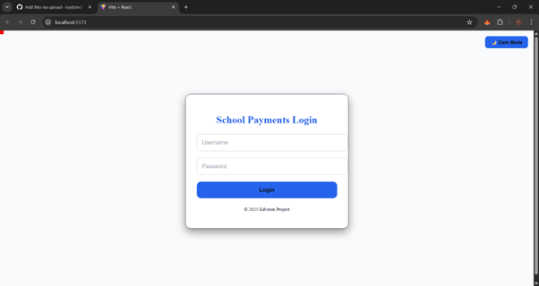
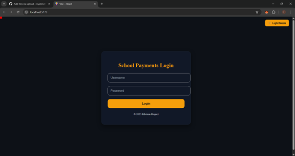
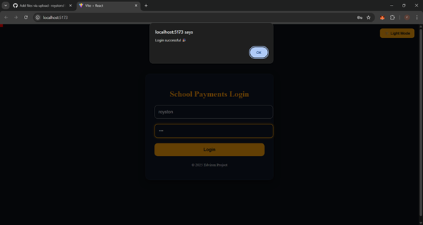
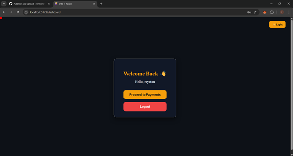
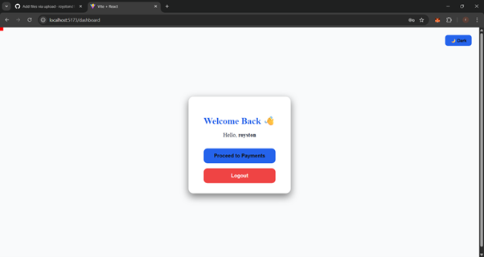

School Payment & Dashboard Application

A full-stack microservice-based project that handles school payments and transaction management.
This project includes a JWT-secured backend (Node.js + Express + MongoDB Atlas) and a React frontend with Day/Night mode, dashboard features, and payment integration.

🚀 Features
🔑 Authentication

Secure login system with JWT.

Users cannot proceed unless they include a valid token in the request header.

🎨 Frontend (React + Tailwind)

Day & Night Mode toggle across all pages.

Login Page → Authenticates user and stores token.

Dashboard Interface with:

Dummy transactions populated for testing.

Pagination support for large datasets.

Sorting & Filtering by status, school ID, and date.

Searchable Transactions Table.

Transaction Details Page → Fetch transactions by school.

Transaction Status Check → Query by custom_order_id.

🏦 Backend (Node.js + MongoDB)

Order Schema → Order-related information.

Order Status Schema → Transaction/payment details.

Webhook Logs Schema → Stores webhook payloads for debugging.

JWT Authentication Middleware → Protects all endpoints.

/create-payment Endpoint → Integrates with Payment Gateway API, forwards request, and redirects to payment link.

/webhook Endpoint → Updates DB with transaction details on payment completion.

/transactions Endpoint → Fetches all transactions (with pagination + sorting using aggregation).

/transactions/school/:schoolId Endpoint → Filters by school.

/transaction-status/:custom_order_id Endpoint → Fetches status of specific order.

🖼️ Screenshots
🔐 Login Page

✅ Successful Login (Dashboard Access)

📊 Dashboard - Day Mode

🌙 Dashboard - Night Mode

💳 Transactions Table with Pagination & Sorting &  Payment Gateway Integration

⚙️ Tech Stack

Backend

Node.js

Express.js

MongoDB Atlas

Mongoose

JWT Authentication

Frontend

React.js

Vite (or CRA)

Tailwind CSS

Axios

React Router

Other Tools

Postman (API Testing)

Git & GitHub

Cloud Hosting (Heroku/Render for Backend, Netlify/Vercel for Frontend)
